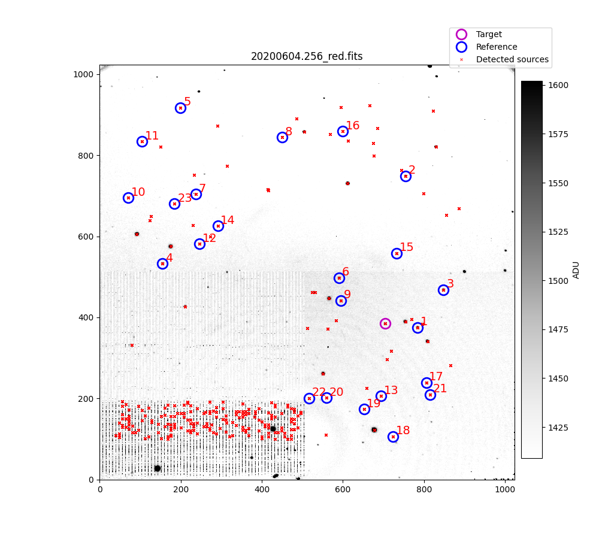
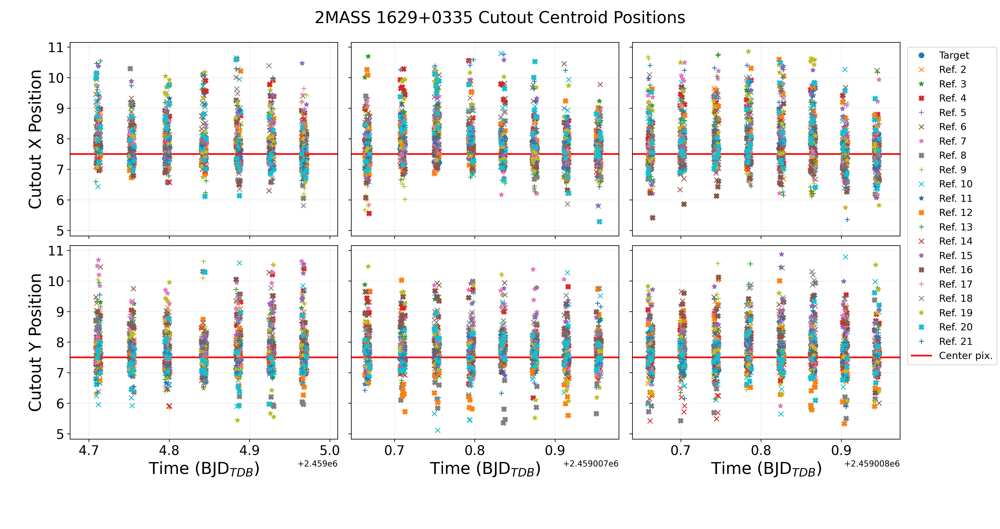

Tutorial
========
To demonstrate some of the functionality of PAT, let's walk through an end-to-end example for SIMP J16291840+0335371 (SIMP 1629+0335), a known variable T2 brown dwarf whose rotation period was recovered by PINES. 

Creating Calibration Data
*************************
To start, we have to create some calibration files that we will use to reduce the raw image data. PAT has a top-level program to do this called ''make_calibrations''.

.. code-block:: python

   import pines_analysis_toolkit as pat 

   #Create an sftp connection to the PINES server to download data.
   sftp = pat.utils.pines_login()

   #SIMP 1629+0335 was observed with 60-s exposures in J-band. 60-s darks and J-band flats
   #were taken on 20200531 during this run, and those parameters should be specified here. 
   exptimes = [60]
   bands = ['J']
   dark_dates = ['20200531']
   flat_dates = ['20200531']

   #Now we can simply call make_calibrations to start making the calibration files. 
   #They will be saved to your ~/Documents/PINES_analysis_toolkit/Calibrations/ directory
   #by default, in appropriately named subdirectories. 
   pat.data.make_calibrations(sftp, exptimes, bands, dark_dates, flat_dates)

Note that this will take a while to run, particularly to create the hot pixel and dead pixel maps (which we refer to as 'hpm' and 'dpm', respectively). In the hpm and dpm functions, the code iteratively loops over every pixel in the master dark/flat and checks its value against a box of its neighbors. When no more hot/dead pixels are identified, the box size shrinks, and the process starts over. Creating all the calibration data will likely take on the order of one hour, and when it's done you should have the following fits images in your ~/Documents/PINES_analysis_toolkit/Calibrations/ folder: 

   1. Master 60-s dark
   2. Master J-band flat
   3. Variable pixel mask ('vpm')
   4. Hot pixel mask ('hpm')
   5. Dead pixel mask ('dpm')
   6. Bad pixel mask ('bpm')

You have to create these files for every band/exposure time combination that was used to observe your target. For example, say we had another target that was observed during this run that was observed for 30-s in J-band on some nights, and 10-s in H-band on other nights. Let's assume that the the 30-s darks were take on 20200530, and J-band flats were taken on 20200529. Assume that the 10-s darks and H-band flats were both taken on 20200531. We could set up the call to make_calibrations like this:

.. code-block:: python

   exptimes =   [30,         10]
   bands =      ['J',        'H']
   dark_dates = ['20200530', '20200531']
   flat_dates = ['20200529', '20200531']
   
   pat.data.make_calibrations(sftp, exptimes, bands, dark_dates, flat_dates)

This would then create the appropriate calibration files for both the 30-s J-band observations and the 10-s H-band observations, and you're ready to move on to reducing the data when it's finished.

Finally, note that make_calibrations() checks your ~/PINES_analysis_toolkit/Calibrations directory to see if the calibration files already exist before running, because it's so time intensive. If you want to replace a calibration file for whatever reason, you'll have to delete it from the Calibrations directory.

Reducing Raw Data
*****************
With the calibration files created, we are ready to reduce data. That can be done with the following: 

.. code-block:: python

   target = '2MASS J16291840+0335371'
   short_name = pat.utils.short_name_creator(target)
   sftp = pat.utils.pines_login()

   #Download raw data to ~/PINES_analysis_toolkit/Objects/2MASS 1629+0335/raw/
   pat.data.get_raw_science_files(sftp, target)

   #Save reduced images to ~/PINES_analysis_toolkit/Objects/2MASS 1629+0335/reduced/ 
   pat.data.reduce(short_name, delete_raw=True)

Check your ~/PINES_analysis_toolkit/Objects/ folder. There should now be a directory for 2MASS 1629+0335, and its 'reduced' folder should be full of the newly reduced images. There should be nothing in its 'raw' folder; we deleted the raw files with the delete_raw=True flag in the call to reduce(). If you want to keep the raw files, set delete_raw=False (but you shouldn't need them for the rest of this example). 

Identifying the Target and Reference Stars
******************************************
We can now move on to identifying the target and a set of suitable reference stars in the field. The reference stars will be used later to create an 'artificial light curve' (ALC) to remove trends in flux that are common to the target and references. First, we have to grab some supporting data from a '.profile' file for the target: 

.. code-block:: python

   profile_data = pat.utils.profile_reader(short_name)

If the profile file didn't exist, profile_reader() will create one with some default parameters in the top level of the object folder. profile_data is a dictionary containing a number of arguments that will affect the selection of reference stars. Here's an example of the .profile file for 2MASS 1629+0335:
 
 ::

   source_detect_image  = 20200604.256_red.fits #The image used to detect references
   exclude_lower_left   = True #Whether or not to exclude references in the lower left quadrant (due to an issue with bars in Mimir images)
   dimness_tolerance    = 0.40 #The minimum multiple of the target's brightness that a reference can have and still be selected
   brightness_tolerance = 3.0 #The maximum multiple of the target's brightness that a reference can have and still be selected
   distance_from_target = 900 #The maximum distance from the target (in pixels) that a reference can be and still be selected
   non_linear_limit     = 3750 #The highest value (in ADU) that a reference pixel can have and still be selected
   edge_tolerance       = 40 #The closest a star can be to the edge of the detector and still be selected as a reference
   guess_position_x     = 700 #The approximate x pixel location of the target in source_detect_image
   guess_position_y     = 382 #The approximate y pixel location of the target in source_detect_image

If you get too few/too many reference stars, you can edit the parameters in the .profile file to try and generate a new set! You could also just change them in the call to ref_star_chooser(), but the profile method is better since it preserves a record of the parameters you used for each target. Now, we're ready to find the target and reference stars. 

.. code-block:: python

   sources = pat.photometry.ref_star_chooser(short_name, profile_data['source_detect_image'],
    guess_position=(profile_data['guess_position_x'],profile_data['guess_position_y']), 
    exclude_lower_left=profile_data['exclude_lower_left'], 
    dimness_tolerance=profile_data['dimness_tolerance'], 
    brightness_tolerance=profile_data['brightness_tolerance'], 
    distance_from_target=profile_data['distance_from_target'], 
    non_linear_limit=profile_data['non_linear_limit'], 
    edge_tolerance=profile_data['edge_tolerance'])

Running this will pull up the following plot: 

23 reference stars that meet the criteria passed to reference_star_chooser() were returned, and are indicated as blue circles with ID numbers. The target is shown in a magenta circle, and was identified using the guess_x_position and guess_position_y entries in profile_data. The red x's without circles around them indicate detected sources that were not chosen as reference stars. 

You will notice that a number of obviously incorrect sources were found in the lower left quadrant. This is due to the bar structure that can be seen in the source_detect_image, which is an occasional problem encountered with the Mimir detector. We avoided taking any of these sources as references by setting exclude_lower_left = True in the .profile file. 

The code stops at this point and waits for user input indicating any bad reference stars that should be dropped. The automatic source detection is not perfect and sometimes finds image artifacts as potential references, and we need to remove these before we continue. You should do this by zooming in on the reference stars in the matplotlib window and noting the IDs of any bad references. There is one candidate reference in this field that don't look so good, with an ID of 22.

Candidate reference 22 is really close to the bars that are present in the lower left quadrant. X shifts in the field position during guiding could easily move it into the barred region, so we should drop it. To get rid of these candidate references, we would enter the following into the terminal:

.. code-block:: python

   >>> Enter IDs of references to remove, separated by commas (e.g.: 1,4,8,14).
   >>> If none to remove, hit enter: 22

This pulls up a new image of the field, with only the reference stars you want to keep:

If you're happy with the selected references, type y and hit enter on the command line. If you want to try a new set, exit the program, edit the entries in the .profile file, and re-run. 

When ref_star_chooser() finishes, it saves a file called 'target_and_references_source_detection.csv' to the object's 'sources/' directory. This contains the names of the target/references and their x and y pixel positions in the source_detect_image. It also saved a file called 'extra_shifts.txt'. These are the measured x and y pixel shifts of the source_detect_image compared to the master image that was used to take observations, and these extra shifts are needed to figure out where sources are in relation to their positions in source_detect_image. 

Generating an Astrometric Solution and Source Spectral Types
************************************************************
Mimir images do not have a built-in astrometric solution, meaning we only have pixel coordinate information for our sources. We would like to have RA and Dec coordinates for them, so we can pass these coordinates to other archives (like 2MASS or Gaia) and get some information about the spectral types (SpTs) of our reference stars. The astrometry module in PAT has routines that can help us with this, but before you start, you should create an account on `astrometry.net <http://nova.astrometry.net/m>`_ and note your API key. 

.. code-block:: python 

   api_key = '...'
   pat.astrometry.source_detect_astrometry(short_name, api_key, profile_data['source_detect_image'])

api_key should be replaced with the key associated with your astrometry.net account. This program will upload the source_detect_image to astrometry.net, which will attempt to generate an astrometric solution for the image. Once one is found, it will be downloaded to your local machine, and the header information in source_detect_image will be updated with the WCS information from astrometry.net. The processing on astrometry.net typically takes a few minutes, so be patient. 

Now, we can get the RA and Dec coordinates for the measured locations of our target and reference stars in source_detect_image: 

.. code-block:: python

   sources = pat.astrometry.source_pixels_to_world(short_name, profile_data['source_detect_image'])

This updates the sources dataframe and the source_detection csv file in the object's sources/ directory to include RA and Dec coordinates for all the sources. We can now pass these coordinates to Gaia and use the measured Bp-Rp colors to generate an estimate of source SpTs:

.. code-block:: python

   sources = pat.astrometry.gaia_cmd(short_name, sources)

This again updates the sources dataframe and source_detection csv, adding columns for M_G, bp_rp, SpT, and Teff. It also saves a color-magnitude diagram to the sources/ directory:

The information about source SpTs can be used when creating light curves to de-weight the bluest reference stars, which can introduce systematic variations to the target light curve if precipitable water vapor (PWV) levels change significantly throughout the night. 

Centroids
*********
The next step is to determine the locations of our target and reference stars in every image, which will be used to place photometric apertures around sources. This is accomplished with a 2D Gaussian centroiding method from photutils performed on cutouts surrounding the source positions. PAT uses the locations of sources in source_detect_images and the measured x/y pixel shifts in the observing logs from the telescope to determine where to make these cutouts, then does the centroiding. As long as the measured image shifts are accurate and there are not weird things in the cutout (e.g., multiple sources, cosmic rays, unflagged bad pixels, etc.), things should run smoothly. 

.. code-block:: python

   centroided_sources = pat.photometry.centroider(short_name, sources, restore=False, output_plots=False, box_w=30)

Here, we have specified that the centroiding program should use cutouts of size 30x30 pixels. output_plots has been set to False, but if you set it to True, it will save images of the measured centroids for each source in the object's sources/ directory (warning: this will make the program take much longer to run, but it's useful as a sanity check if you're worried about your centroid positions). When centroider() finishes, it will save a csv of the pixel positions for every source in every image to the object's sources/ directory.

Photometry
**********
We are finally ready to perform photometry. The package currently supports both fixed aperture photometry and variable aperture photometry (with aperture radii a user-specified multiple of the measured seeing FWHM). In the future, it may also support PSF photometry. For now, let's do fixed aperture photometry with 4.0-, 5.0-, 6.0-, and 7.0-pixel radius apertures: 

.. code-block:: python

   pat.photometry.fixed_aper_phot(short_name, centroided_sources, ap_radii=[4.0,5.0,6.0,7.0])

Output from this program will be saved as csv files in the object's aper_phot/ directory. These files contain the measured flux, flux error, and background (all in e-) for every source in every image. 

Light Curves
************
We can now use the measured fluxes to create a light curve for the target. We will do this with the weighted_lightcurve() function, which tries to de-weight variable reference when making the artificial light curve (ALC) that is used to correct the target flux. This program will inspect all of the photometry files in the directory, and will save a text file reporting the optimal aperture size based on the measured scatter of corrected reference star light curves.

.. code-block:: python

   pat.analysis.weighted_lightcurve(short_name, phot_type='aper', mode='night')

Here, we have specified that the code should look in the aper_phot directory for flux files, and the program should be run in 'night' normalization mode (as opposed to 'global'). In night normalization mode, each night of observations is treated as its own dataset, and each is normalized to 1. In global normalization mode, all nights are treated as one data set, and the entire time series is normalized to 1. In practice, we have found that night normalization mode produces better looking light curves. 

This program will save a csv containing the corrected flux to the aper_phot/aper_phot_analysis/ directory for each aperture size tested. Let's use it to make a light curve!

.. code-block:: python
   
   #First, get the path to the best light curve csv file:
   pines_path = pat.utils.pines_dir_check()
   optimal_ap_path = pines_path/('Objects/'+short_name+'/analysis/optimal_aperture.txt')
   with open(optimal_ap_path, 'rb'):
      best_ap = str(f.readlines()[0]).split(':')[1].split('\\')[0].replace(' ','')
   lc_path = pines_path/('Objects/'+short_name+'/analysis/aper_phot_analysis/'+best_ap+'/'+short_name+'_'+best_ap.split('_')[1]+'_aper_phot_r='+best_ap.split('_')[0]+'_nightly_weighted_lc.csv')
   
   #Now make a plot of the normalized target flux and ALC flux versus time
   pat.analysis.alc_plot(lc_path)

   #Now make a plot of the corrected target flux versus time
   pat.analysis.corr_target_plot(lc_path)

This program generated the following images in the analysis/aper_phot_analysis/4.0_fixed/ directory:

The second plot is the one we actually care about, showing the corrected target light curve over three observing nights. There is a clear signature of variability in this light curve!

Diagnostic Plots and DV Report
******************************
As a final step, we can generate some standard plots of certain diagnostic parameters. We can check these against our measured target flux and see if it correlates with any of the diagnostics (airmass, background, cutout positions, absolute image positions, seeing). If it does, it may mean that we did not detect genuine variability in the target light curve, but rather that we're seeing some systematic effect. 

.. code-block:: python

   pat.analysis.relative_cutout_position_plot(short_name)
   pat.analysis.absolute_image_position_plot(short_name)
   pat.analysis.seeing_plot(short_name)
   pat.analysis.background_plot(short_name)
   pat.analysis.airmass_plot(short_name)

These functions generated the following plots in the object's analysis/diagnostic_plots/ directory: 

We can also generate light curves for all of the reference stars: 

.. code-block:: python

   pat.analysis.corr_all_sources_plot(lc_path)

This creates a light curve for the target and all reference stars in the same directory as lc_path in a subdirectory called 'corr_ref_plots/'. 

Finally, all of the relevant plots can be compiled into a PINES Data Validation (DV) Report.

.. code-block:: python

   pat.output.dv_report(target)

This will compile the plots into a PDF in the object's output/ directory. And with that, we're finished!
